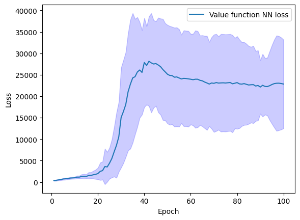

# DeepRL
My implementation of Deep RL algorithms. I use [gymnasium](https://gymnasium.farama.org/index.html) environments for testing.

So far I've added REINFORCE and REINFORCE with baseline. I plan to add Actor-Critic and PPO here as well. 

Here is the performance plot for REINFORCE in the [Cart Pole](https://gymnasium.farama.org/environments/classic_control/cart_pole/) environment:

This is averaged performance over 30 runs, for 100 epochs, approximately 5000 steps per epoch. CartPole env truncates at 500 steps with the maximum total reward 500. Both algorithms reach it asymptotically.

Both average performance and variance are better with baseline. Here I used a small neural net (1 hidden layer with 32 nodes) for the value function. One can presumably improve by increasing the size of the value function neural net.

It is also interesting to look at the value function neural net loss during training:

It grows significantly between the epochs 20 and 40. I believe this is due to the fact that the targets for the value function neural net are non-stationary. The increase in the loss is the largest precisely when the policy improves the most and therefore targets change a lot. We see on the rewards plot that total reward per episode also changes the most roughly between epochs 20 and 40.

